---
## Front matter
title: "Шаблон отчёта по лабораторной работе"
subtitle: "3"
author: " Разанацуа Сара Естэлл , НКАбд-05-23"
## Generic otions
lang: ru-RU
toc-title: "Содержание"

## Bibliography
bibliography: bib/cite.bib
csl: pandoc/csl/gost-r-7-0-5-2008-numeric.csl

## Pdf output format
toc: true # Table of contents
toc-depth: 2
lof: true # List of figures
lot: true # List of tables
fontsize: 12pt
linestretch: 1.5
papersize: a4
documentclass: scrreprt
## I18n polyglossia
polyglossia-lang:
  name: russian
  options:
	- spelling=modern
	- babelshorthands=true
polyglossia-otherlangs:
  name: english
## I18n babel
babel-lang: russian
babel-otherlangs: english
## Fonts
mainfont: PT Serif
romanfont: PT Serif
sansfont: PT Sans
monofont: PT Mono
mainfontoptions: Ligatures=TeX
romanfontoptions: Ligatures=TeX
sansfontoptions: Ligatures=TeX,Scale=MatchLowercase
monofontoptions: Scale=MatchLowercase,Scale=0.9
## Biblatex
biblatex: true
biblio-style: "gost-numeric"
biblatexoptions:
  - parentracker=true
  - backend=biber
  - hyperref=auto
  - language=auto
  - autolang=other*
  - citestyle=gost-numeric
## Pandoc-crossref LaTeX customization
figureTitle: "Рис."
tableTitle: "Таблица"
listingTitle: "Листинг"
lofTitle: "Список иллюстраций"
lotTitle: "Список таблиц"
lolTitle: "Листинги"
## Misc options
indent: true
header-includes:
  - \usepackage{indentfirst}
  - \usepackage{float} # keep figures where there are in the text
  - \floatplacement{figure}{H} # keep figures where there are in the text
---

# Цель работы

- В этой лабораторной работе мы рассмотрим более простой способ написания лабораторного отчета с использованием облегченного языка разметки Markdown.

# Выполнение лабораторной работы

- Прежде всего, мы открываем терминал и переходим в каталог, созданный во время выполнения третьего круга, когда мы обновляем и загружаем изменения из удаленного репозитория с помощью команды git pull. (рис. @fig:001).

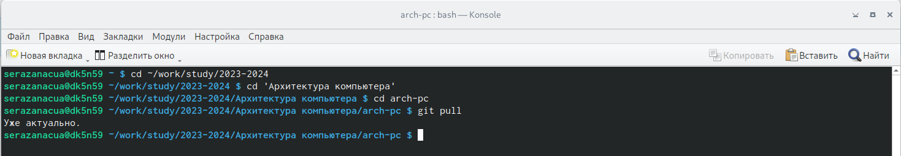{#fig:001 width=100%}

- Затем мы перешли к каталогу с шаблоном для лабораторного отчета No 4.
Затем мы скомпилировали шаблон, используя Makefile с помощью команды
make.(рис. @fig:002).

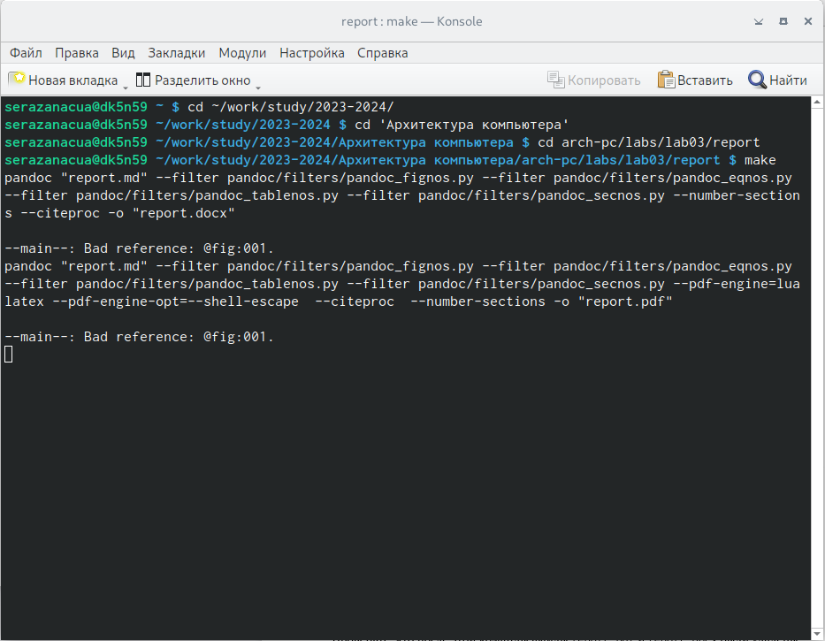{#fig:002 width=100%}

- После успешной компиляции мы получили два файла report.docx и
report.pdf , мы смогли проверить это, используя как команду ls, так и
графический файловый менеджер. (рис. @fig:003) (рис. @fig:004) 
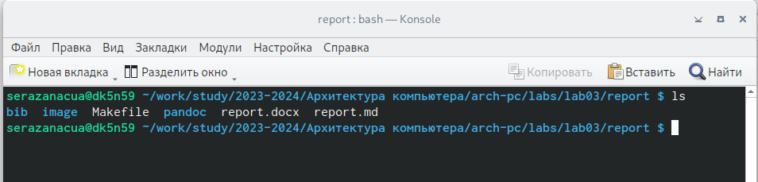{#fig:003 width=100%}
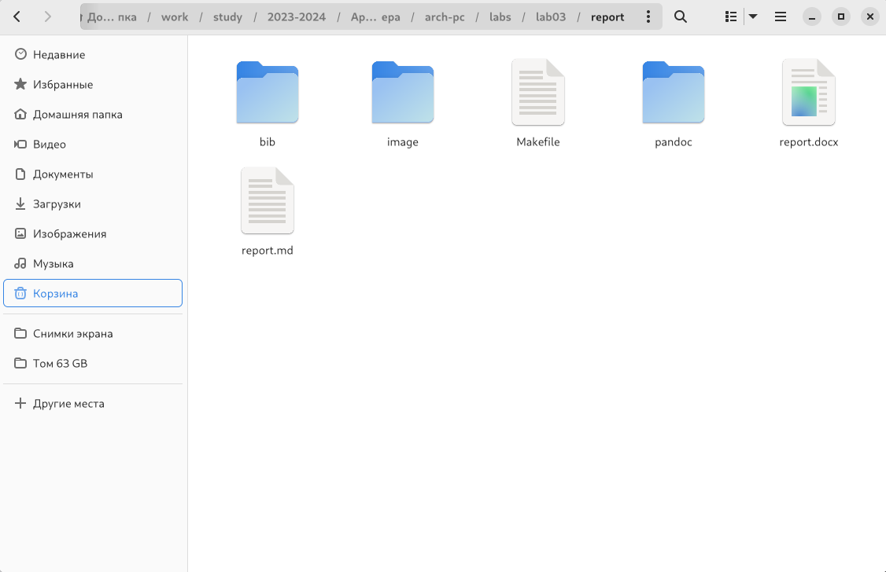{#fig:004 width=100%}

- После этого мы удалили созданные файлы с помощью makefile с помощью
команды make clean и мы проверили, что файлы действительно были уда-
лены с помощью команды ls. (рис. @fig:005).

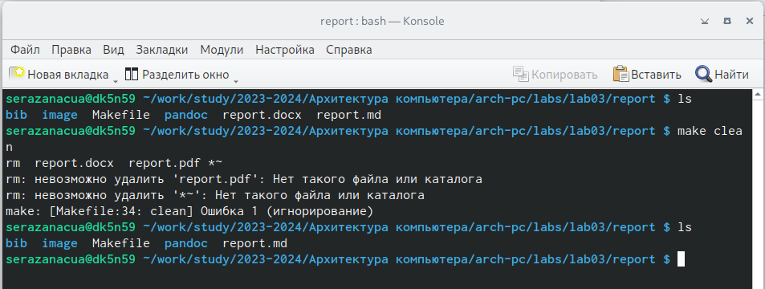{#fig:005 width=100%}

- После этого мы заполнили отчет report.md и скомпилировал выходные данные. (рис. @fig:006).

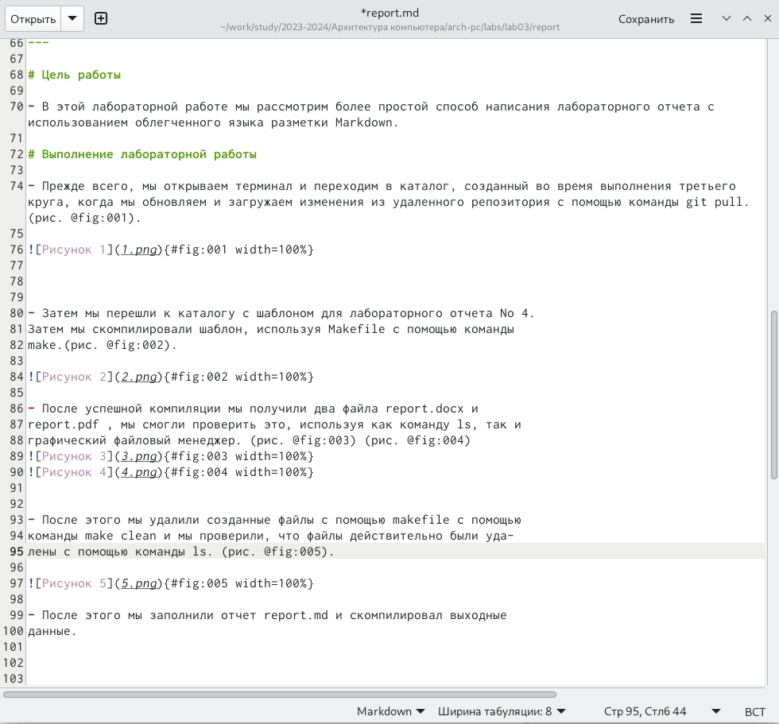{#fig:006 width=100%}

- Затем нам нужно было поместить созданные файлы в ваш удаленный репо-
зиторий, поэтому мы перешли в локальный репозиторий и ввели следую-
щие команды, как указано ... (рис. @fig:007).

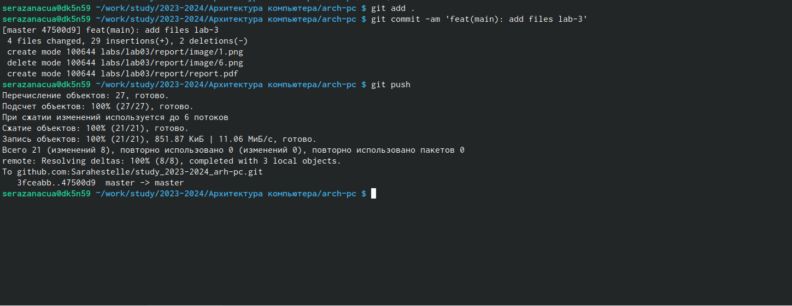{#fig:007 width=100%} 

# Задание для самостоятельной работы 

- В этой части работы первое, что нам нужно сделать, это перейти в правиль-
ный каталог, который после этого был выделен для третьей лаборатории, и
с помощью команды gedit мы запустили файл report.md итак, мы можем
приступить к подаче третьего отчета. (рис. @fig:008)(рис. @fig:009)

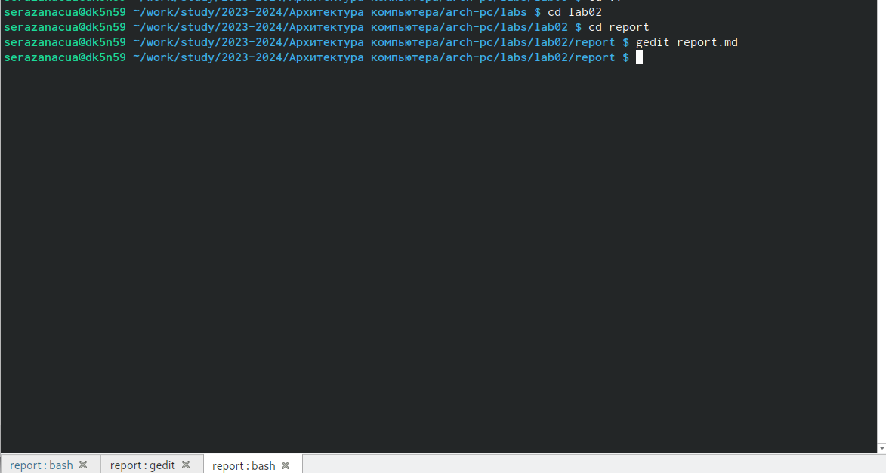{#fig:008 width=100%} 
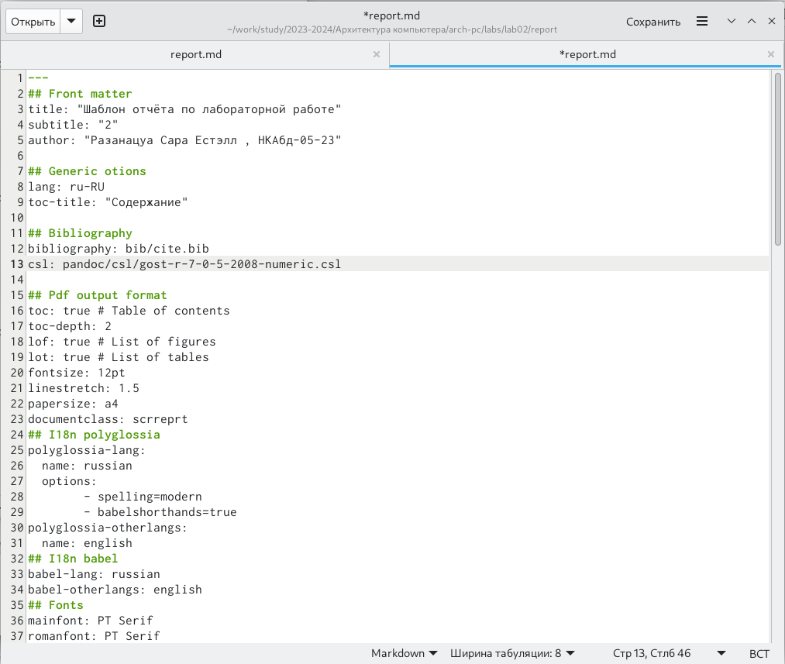{#fig:009 width=100%} 

- После этого мы заполнили отчет по результатам работы, проделанной в
третьей лаборатории.

- После заполнения отчета мы составили report.md используя makefile, ко-
торый предоставляет отчет в двух разных форматах.(рис. @fig:010)

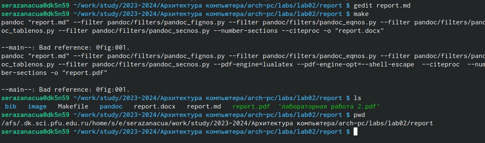{#fig:010 width=100%} 

-  После этого мы перенесли все созданные файлы в удаленный репозиторий.(рис. @fig:011)

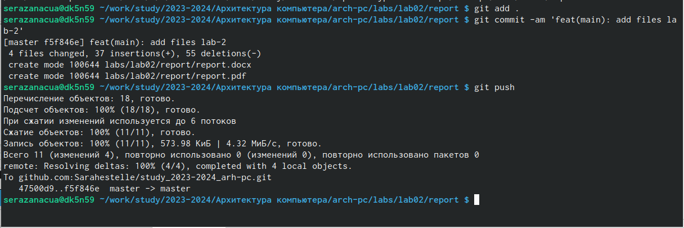{#fig:011 width=100%} 

# Выводы

- в этих упражнениях мы применили все навыки, полученные в теорети-
ческой части, и попытались заполнить отчет для третьей лабораторной
работы, используя markdown, и переместили файлы в удаленное хранили-
ще в соответствующем каталоге

# Список литературы{.unnumbered}

::: {#refs}
:::
